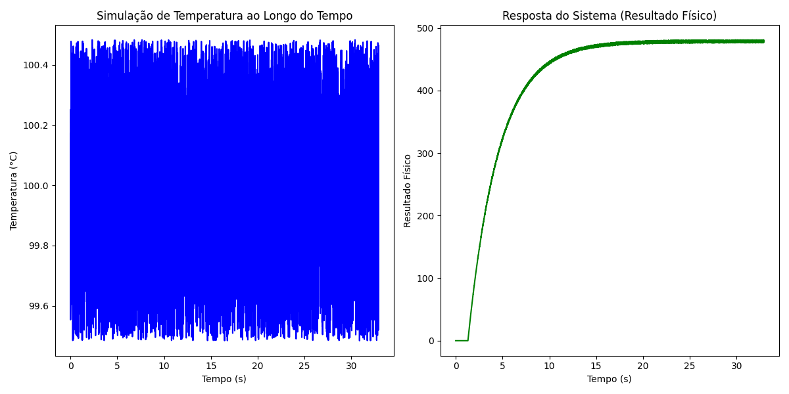
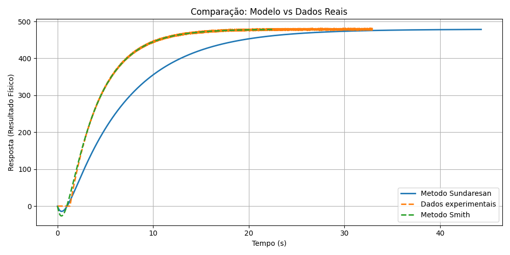
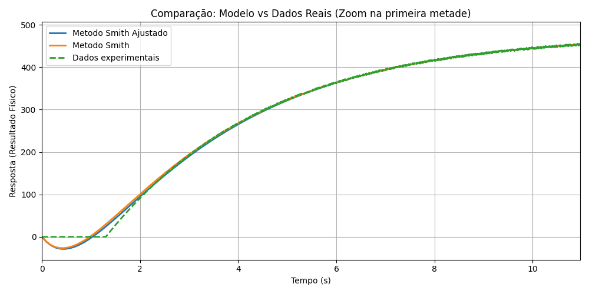
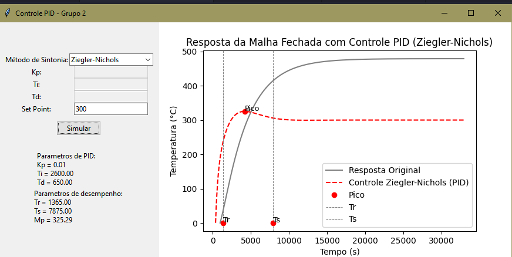
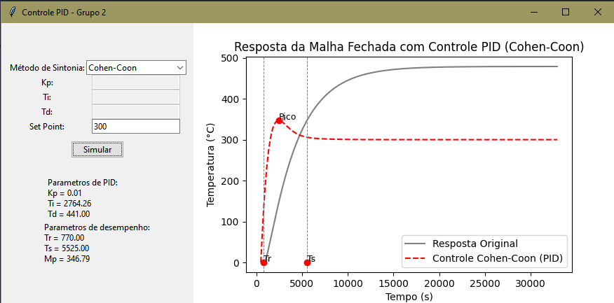
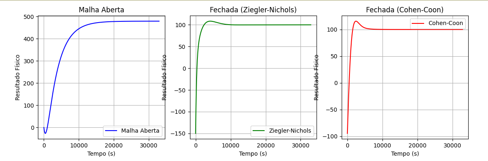

# Controlador PID para branqueamento térmico de glicerina

*Grupo 2  -  Integrantes: Júlia de Freitas e Gabriella Gonçalves Moreira*

O projeto busca aplicar um sistema controlado PID para o controle da temperatura do procasso de branqueamento térmico da glicerina.

## Etapas

1) Analise do conjunto de dados

  - Variavel de tempo: Tempo (
  - Variavel de referência: Temperatura (°C) 
  - Variavel controlada: Resultado Fisico (°C) 

  Abaixo é possivel observa os dados de entrada e saída do sistema:

  

  
  

2) Aplicação dos Metodos de Sundaresan e Smith para calculo de K, 𝜏 e θ

  O método de Smith foi escolhido por apresentar melhor aderência aos dados experimentais, com resposta mais próxima à curva real.

  Comparado ao método de Sundaresan, o modelo de Smith representa melhor o tempo de resposta e o valor final, além de obter menor erro quadrático médio (EQM).

  

  
  

3) Aplicação de ajustes finos para aproximação satisfatória

  Apesar de a função obtida pelo método de Smith já apresentar resultados satisfatórios, foram realizados ajustes finos visando aprimorar a resposta do sistema.
  Como pode ser observado a seguir, esses ajustes resultaram em uma sutil melhora no modelo, com maior aderência aos dados experimentais.
  

  
  

4) Implementação dos métodos de sintonia Ziegler-Nichols e Cohen-Coon para calculo dos parametros do PID

  Nesta etapa, foram aplicados os métodos clássicos de Ziegler-Nichols e Cohen-Coon para determinar os parâmetros do controlador PID: ganho proporcional (Kp), tempo integral (Ti) e tempo derivativo (Td).

  - Ziegler-Nichols (método da resposta ao degrau): baseado na análise da resposta transitória do sistema, utiliza os parâmetros de ganho, tempo morto e constante de tempo para definir regras empíricas de sintonia que priorizam resposta rápida, ainda que com algum overshoot.

  - Cohen-Coon: método mais refinado que também utiliza os parâmetros da resposta ao degrau, mas busca um equilíbrio entre desempenho e estabilidade, oferecendo melhor resposta em sistemas com tempo morto significativo.

  Ambos os métodos foram implementados para comparar o desempenho das malhas fechadas e analisar qual técnica resulta em melhor comportamento dinâmico do sistema.

5) Implementação do controle PID

  Com os parâmetros PID calculados pelos métodos de sintonia (Ziegler-Nichols e Cohen-Coon), o controlador PID é implementado para ajustar a temperatura do processo de branqueamento térmico da glicerina, mantendo a saída controlada e aproximando-a do setpoint desejado.

  

  
  
  

6) Comparação entre os sistemas de malha aberta e fechada 

  Compara-se o desempenho do sistema sem o controlador (malha aberta) e com o controlador PID (malha fechada). como se popde observar a seguir:

  

  
  

  O método Cohen-Coon apresenta o menor tempo de resposta, alcançando rapidamente o valor de regime, embora com maior overshoot. No entanto, oferece uma estabilização eficiente. Por outro lado, o método Ziegler-Nichols resulta em menor overshoot, mas leva mais tempo para estabilizar. A malha aberta, por sua vez, tem desempenho significativamente inferior, apresentando uma resposta muito mais lenta.

